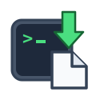
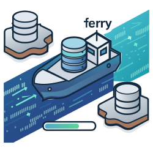

## Hi, I'm XingKaiXin 👋

I'm **Kevin Xing**, also known as **XingKaiXin** or **xingkaixin**.
Based in Shanghai.

Life should not be limited to a single mode of experience, and not everyone needs to live with the singular focus of a nail. I prefer to be broadly curious and experience different dimensions of work and life. That, to me, is another form of fulfillment.

Outside of work and continuous learning, I am also a photography enthusiast and someone who enjoys exploring and experimenting with a wide range of digital products.

### My Repo

  
  <b><a href="https://codesesh.xingkaixin.me">CodeSesh</a></b> – One place to browse all AI coding sessions. Auto-scan local filesystem, render Claude Code, Cursor, Kimi and more in a unified Web UI with replay, cost stats and full-text search.

  
  <b><a href="https://skills.xingkaixin.me">Skills</a></b> – A unified manager for Claude Code external skill repos. Aggregates upstream vendor skills and custom sources into a standardized skills directory.

  
  <b><a href="https://unquote.xingkaixin.me">Unquote</a></b> – Detects and recursively expands stringified values in JSON. Built for AI model outputs and MCP/Agent tool calls with nested JSON. Supports JSONL, syntax highlighting and path display.

  
  <b><a href="https://agent-dump.xingkaixin.me">Agent Dump</a></b> – AI coding assistant session export tool. Supports Claude Code, OpenCode, Codex, Kimi and more with interactive selection, batch export and token stats.

  
  <b><a href="https://ddl.xingkaixin.me">DDLBuilder</a></b> – Multi-database DDL generator. Generate MySQL, PostgreSQL, Oracle and six more databases' CREATE TABLE statements via form input. Supports partition tables, indexes, privilege config and SQL import parsing.

  
  <b><a href="https://db-ferry.xingkaixin.me">DB Ferry</a></b> – Multi-database migration CLI tool. Stream data between Oracle, MySQL, PostgreSQL, SQLite and more via declarative task.toml config. Supports resume and batch verification.

### Find Me

[X](https://x.com/xingkaixin) · [Telegram](https://t.me/xingkaixin) · [Blog](https://xingkaixin.me)
